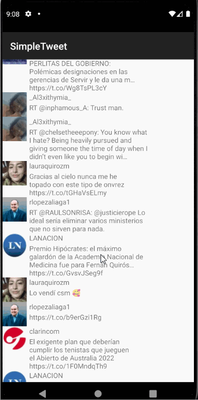

# Unit 3 Project: Twitter Client - Part 1

## Overview
Build a simple Twitter client that supports viewing a Twitter timeline.

### User Histories

User can sign in to Twitter using OAuth login

User can view the tweets from their home timeline

For each tweet, show the relevant information: the tweet body along with the author's username and name
 Creating the Timeline
 API Request and creating models
Sending Network Requests
 Showing the data with a RecyclerView
Using the RecyclerView

User can refresh tweets timeline by pulling down to refresh

### Stretch stories
User can view more tweets as they scroll with infinite pagination

Improve the user interface and theme the app to feel "twitter branded"

Links in tweets are clickable and will launch the web browser

 

GIF created with [LiceCap](http://www.cockos.com/licecap/).

### Notes
I faced some challenges working in the implementation of my account of Twitter getting linked with this app.

### Open-source libraries used

- [Android Async HTTP](https://github.com/codepath/CPAsyncHttpClient) - Simple asynchronous HTTP requests with JSON parsing
- [Glide](https://github.com/bumptech/glide) - Image loading and caching library for Androids

    Copyright 2021 Alvaroots97

    Licensed under the Apache License, Version 2.0 (the "License");
    you may not use this file except in compliance with the License.
    You may obtain a copy of the License at

        http://www.apache.org/licenses/LICENSE-2.0

    Unless required by applicable law or agreed to in writing, software
    distributed under the License is distributed on an "AS IS" BASIS,
    WITHOUT WARRANTIES OR CONDITIONS OF ANY KIND, either express or implied.
    See the License for the specific language governing permissions and
    limitations under the License.
